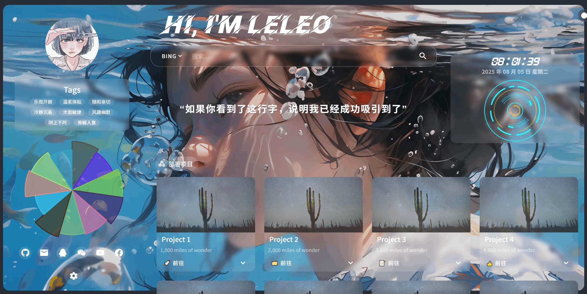
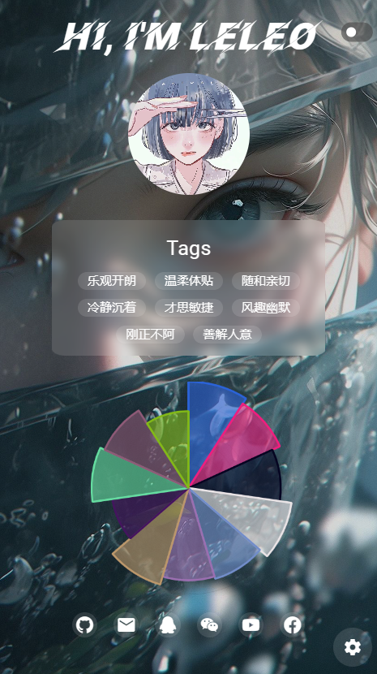
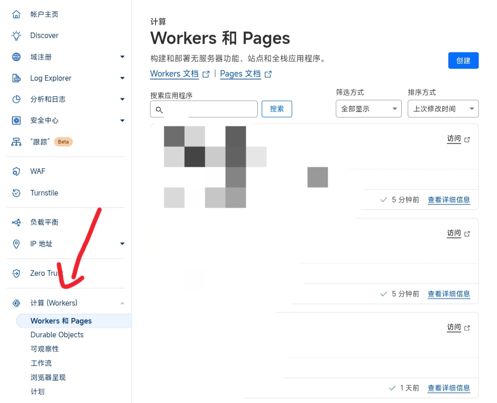
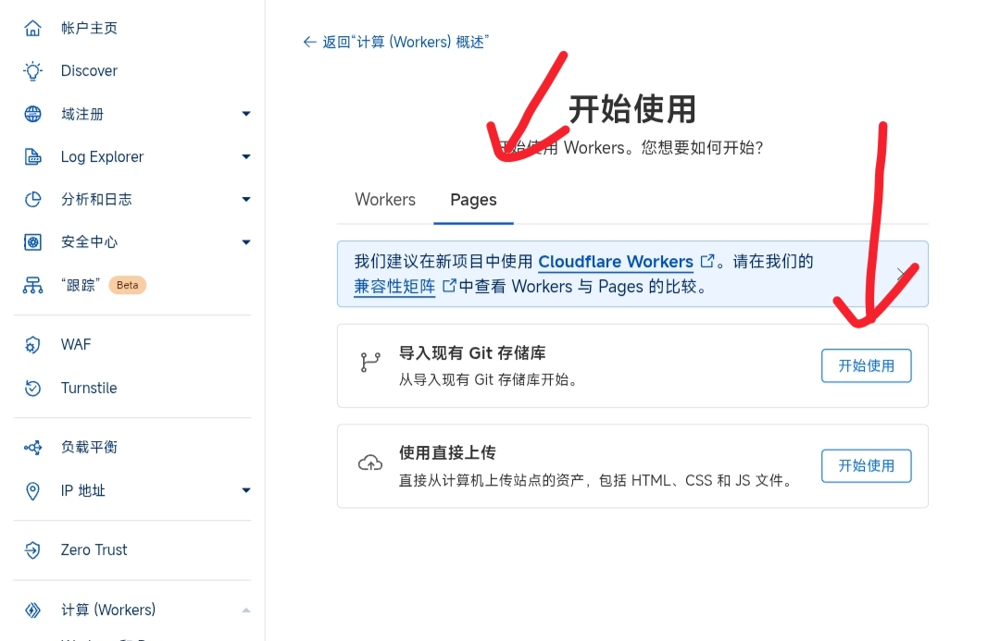
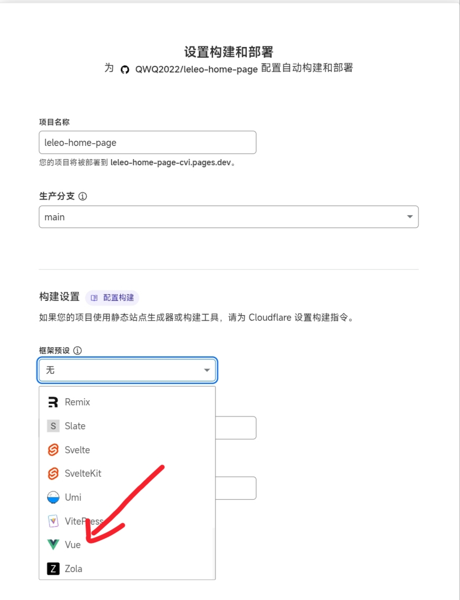
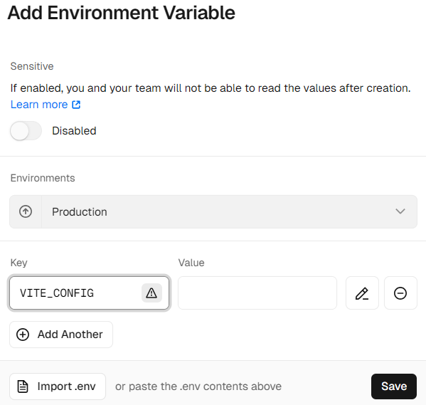
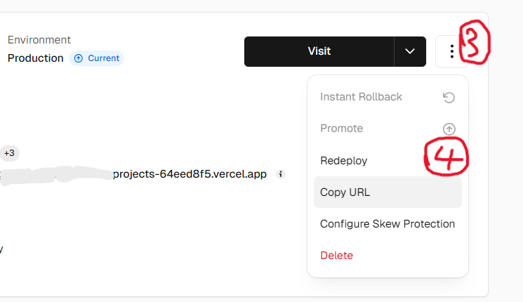
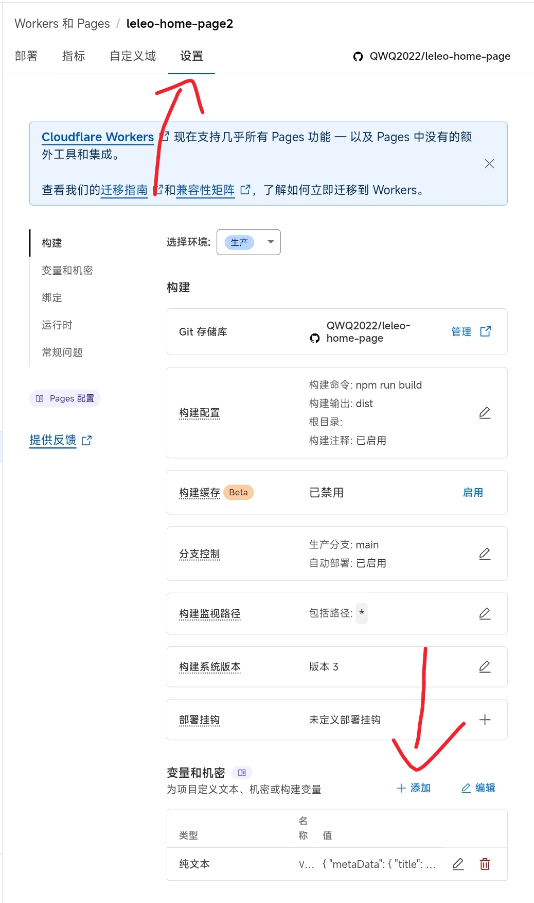
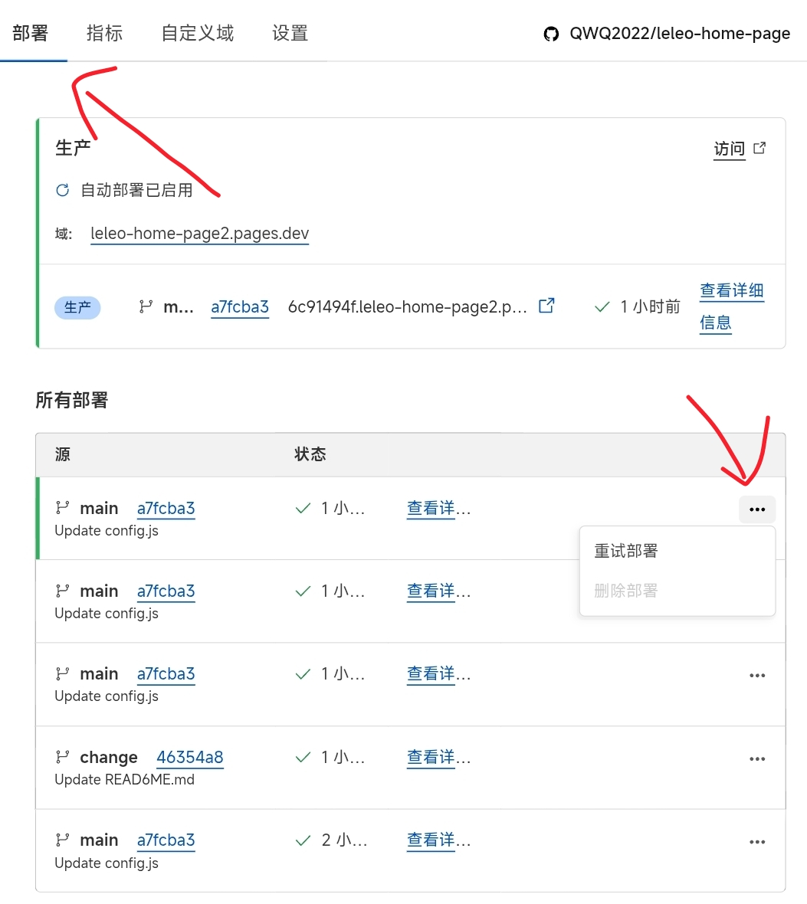

# leleo-home-page 个人主页

## 目录
- [项目简介](#项目简介)
- [功能特性](#功能特性)  
- [演示地址](#演示地址)
- [技术栈](#技术栈)
- [安装与运行](#安装与运行)
  - [本地运行](#本地运行)
  - [Vercel在线部署](#vercel在线部署)
  - [CloudFlare Pages 在线部署](#cloudflare-pages-在线部署)
- [修改配置](#修改配置)


## 项目简介

这是一个简单的个人主页项目，用于展示个人信息、技能、项目等。主页设计简洁、响应式，适合在不同设备上浏览。支持自定义配置。





## 功能特性

- **响应式设计**：适配桌面、平板和手机等不同设备
- **个人信息展示**：包括头像、个性标签、简介、技能等
- **项目展示**：展示项目，包括项目描述、技术栈和链接  
- **预览配置**：支持主题、背景壁纸预览（包括动、静态/PC、移动端壁纸设置）以及音乐播放配置
- **在线部署配置**：支持vercel一键部署及使用vercel环境变量进行在线自定义配置

## 演示地址

[在线演示](https://leleo.top)

## 技术栈

- **前端**：Vue
- **UI框架**：Vuetify  
- **构建工具**：Vite
- **版本控制**：Git
- **部署平台**：Vercel

## 安装与运行

### 本地运行

1. 克隆仓库：

```bash
git clone https://github.com/leleo886/leleo-home-page.git
```

2. 进入项目目录：

```bash
cd leleo-home-page
```

3. 安装依赖：

```bash
npm install
```

4. 启动开发服务器：

```bash
npm run dev
```

### Vercel在线部署

> 无需服务器，点击链接一键在线部署到 [Vercel](https://vercel.com/new/clone?s=https://github.com/leleo886/leleo-home-page.git)（首先需要有github和vercel账号）


> ---登录vercel账号，并选择github关联账号，为项目取个名字，然后点击"Create"按钮开始部署


> ---部署完成后，点击回到控制面板


注意：Vercel提供的`.vercel.app`域名在中国大陆地区可能无法访问，所以建议绑定自定义域名。（若没有自己的域名，这里提供简单的[免费二级域名服务](https://sds.leleo.top)及本项目如何进行域名绑定的[说明](./img/domainToVercel.md)）

### CloudFlare Pages 在线部署

> 无需服务器，对站长友好(需要有CloudFlare以及Github账号)

1. Fork本项目到自己的账号下
   
2. 登录CloudFlare并点击左侧栏目中"计算(workers)"底下的"Workers 和 Pages"



3. 点击右上角"创建"，选择"Pages"，点击"导入现有 Git 存储库"右侧的"开始使用"



4. 点击"连接 Github"，并登录你的 Github 账号

5. 选择项目存储库(如果你没有更名那应该是"leleo-home-page")并开始设置，在接下来的页面中框架预设选择`Vue`(如果不选择，你的网站会访问为空白)，点击保存并部署



此时，项目已经部署完成，可以直接点击上方链接预览

如果需要绑定域名，可以点击"添加自定义域"、"设置自定义域"并填入目标域，点击继续

> 你的域名托管在CloudFlare，直接点击"激活域"就可以完成

> 你的域名没有托管在CloudFlare，根据指引添加CNAME记录即可

## 修改配置

### 方法1. 修改配置文件

自定义数据文件为项目src目录下面的 config.js，这里有[配置说明](./img/config.md)，然后就是代码的拉取、修改上传。如果部署方式为CloudFlare Page，直接在Github修改后Commit即可自动部署

**若使用此方法请勿配置环境变量**

### 方法2. 在线修改环境变量

**注意**：在vercel中此方法优先级高于方法1，CloudFlare中方法1优先级更高

#### vercel部署

> (1). 首先还是打开vercel中本项目主面板，然后依次点击`Settings`、`Environments`、`Production`


> (2). 然后下翻点击`Add Environment Variable`按钮，要求填入`Key`值为`VITE_CONFIG`,`Value`值如[环境变量值](./img/env.md)所示，全部复制粘贴即可（有点多），根据个人情况自定义修改，配置说明同方法1。


> (3). 回到项目主面板，依次点击`Project`、`Build Logs`，进入新页面后再找到`Redeploy`。最后等待重新部署完成即可。



#### CloudFlare部署

> (1). 到你的Pages项目，点击"设置"，找到"变量和机密"点击右侧"添加"


> (2). 要求填入"变量名称"为`VITE_CONFIG`,"值"如[环境变量值](./img/env.md)所示，全部复制粘贴即可（有点多），根据个人情况自定义修改，配置说明同方法1

> (3). 点击"部署"，找到左侧带绿条的那个点击右侧三个点"重试部署" 等待部署完成即可

